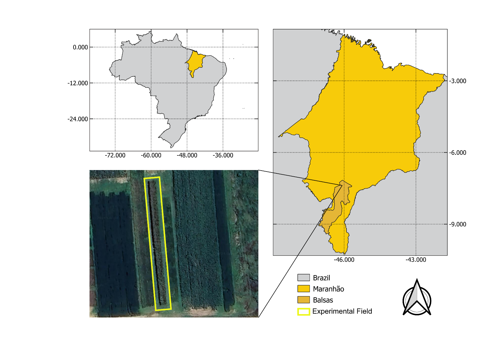

# Dataset: Cowpea Cultivars with Residual Organomineral Fertilizers from Crop Corn Cultivation

**Abstract:** Cowpea is a critical dietary staple, especially in tropical and subtropical regions, due to its high protein content, essential amino acids, and other nutrients. This study aimed to assess the impact of residual organomineral fertilizers from a preceding corn crop on cowpea cultivars in southern Maranhão, Brazil. Two cowpea cultivars, BRS Tucumaque and BRS Nova Era, were evaluated using a randomized block design with three replications. This study incorporated two organomineral fertilizers derived from cattle manure and natural phosphates a simple superphosphate at a dose of 50 kg ha-1, and a control without phosphorus fertilization. The key agronomic traits measured included the number of nodes, pod per plant, grains per pod, thousand-grain weight, and yield per hectare. This research underscores the potential of organomineral fertilizers to enhance cowpea yield while minimizing environmental impact, offering a viable alternative to conventional fertilization methods. These findings advocate broader adoption of organomineral fertilizers in cowpea cultivation, potentially increasing yield and reducing costs. The database derived from this research is composed of 48 samples. Four types of fertilization were considered: control, simple superphosphate and two organomineral fertilizers; two planting systems with and without U. ruziensis straw; and two cultivars.

**Authors:** Carlos Henrique Conceição Sousa, Alan Mario Zuffo, Bruno Rodrigues de Oliveira, Francisco Charles dos Santos Silva, Ricardo Mezzomo, Leandra Matos Barrozo, Tatiane Scilewski da Costa Zanatta, Joel Cabral dos Santos, Yago Pinto Coelho, Aurilucia do Nascimento Silva Caldas

